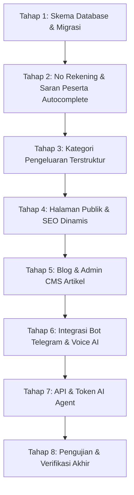

# Rencana Implementasi Pengembangan FairShare

Dokumen ini disusun berdasarkan panduan dari `prompt-pengembangan-fairshare.md` dan hasil audit menyeluruh terhadap arsitektur FairShare saat ini.

---

## 1. Audit Implementasi Saat Ini

### A. Fitur yang Sudah Tersedia
- **Autentikasi & Akun**: Email/password registration, login, logout, sesi JWT berbasis cookie terenkripsi, Google OAuth (`/api/auth/google/callback`).
- **Manajemen Event/Campaign**: Buat event, edit judul/lokasi/tanggal, arsipkan event, hapus event.
- **Peserta Event**: Tambah peserta, edit nama peserta, hapus peserta (dibatasi jika sudah ada pengeluaran).
- **Pencatatan Pengeluaran**: Tambah pengeluaran (pembayar, judul, nominal integer rupiah), edit, hapus, validasi kelayakan.
- **Engine Perhitungan & Pembagian**: Pembagian rata beban (integer division dengan remainder allocation deterministik), penyederhanaan transfer pelunasan (*greedy balance matching*), WhatsApp recap generation, toggle status lunas per settlement.
- **Akses Publik / Share Token**: Tampilan read-only per event melalui token link `/share/[token]`.
- **Database & Migrasi**: PostgreSQL dengan Drizzle ORM, skema auto-healing via `ensureDatabaseSchema` di `src/db/migrate.ts`.
- **Sistem Desain UI**: TailwindCSS kustom terinspirasi *Diskon.com* (palet slate-950, lime `#b7e913`, font Fredoka & JetBrains Mono, kartu rounded 24px `card-diskon`, tombol pill `btn-pill-lime` dan `btn-pill-primary`).

### B. Perubahan Database yang Diperlukan
1. **Tabel `users`**:
   - Kolom `role varchar(20) DEFAULT 'user'` (admin@admin.com diset `'admin'`).
2. **Tabel `members`**:
   - Kolom `bank_account text` (nomor rekening/e-wallet peserta, opsional).
3. **Tabel baru `saved_participants`**:
   - Riwayat peserta per user (`user_id`, `name`, `bank_account`, `use_count`, `last_used_at`).
4. **Tabel `expenses`**:
   - Kolom `category varchar(80) DEFAULT 'Umum'` (referensi kategori pengeluaran).
5. **Tabel baru `user_ai_settings`**:
   - Pengaturan token Telegram bot, AI provider (DeepSeek, Claude, Gemini, OpenCode Go, 9Router, OpenRouter), API key (tersimpan aman), model, voice response mode, telegram chat id terhubung.
6. **Tabel baru `articles`**:
   - Blog CMS (`author_id`, `title`, `slug`, `summary`, `content`, `featured_image`, `status`, `seo_title`, `seo_description`, `published_at`).
7. **Tabel baru `site_pages` & `site_settings`**:
   - Halaman standar CMS (Home, About, Contact, Privacy, Terms) dan Global SEO config (`site_name`, `default_description`, `title_template`, OG image).
8. **Tabel baru `api_tokens`**:
   - Token AI agent (`user_id`, `name`, `token_hash`, `token_prefix`, `scopes`, `last_used_at`, `expires_at`, `is_revoked`).

### C. Potensi Risiko Kompatibilitas & Solusi Mitigasi
- **Kompatibilitas Skema DB Lama**: Menggunakan `ALTER TABLE ... ADD COLUMN IF NOT EXISTS` dan `CREATE TABLE IF NOT EXISTS` pada `src/db/migrate.ts` agar database yang sudah terisi data tidak terhapus atau rusak.
- **Konsistensi Formula Split**: Field nomor rekening dan kategori pengeluaran adalah metadata tambahan yang tidak mengubah invariansi pembagian biaya integer rupiah yang sudah teruji.
- **Isolasi Multi-Tenant / Data User**: Riwayat peserta dan token bot Telegram difilter ketat berdasarkan `user_id` pemilik sesi sehingga data tidak bocor antar pengguna.
- **Akses Draft Artikel & Halaman**: Query publik wajib memfilter `status = 'published'` dan `is_published = true`. Jika status draft, pengunjung publik menerima 404 Not Found.

---

## 2. Rencana Implementasi Bertahap

### Tahap 1: Skema Database & Migrasi
- Perbarui `src/db/schema.ts` dengan tabel dan kolom baru.
- Perbarui `src/db/migrate.ts` dengan DDL SQL idempotent.
- Pastikan semua query dan relasi Drizzle sinkron.

### Tahap 2: Fitur #1 Nomor Rekening & Fitur #3 Saran Peserta
- Tambahkan input nomor rekening pada form peserta (dialog tambah & edit peserta).
- Tampilkan nomor rekening di kartu peserta, dialog rincian saldo, dan daftar transfer pelunasan (*Rencana Pelunasan Transfer*).
- Masukkan informasi nomor rekening tujuan ke teks WhatsApp Recap.
- Buat logic pencatatan otomatis ke `saved_participants` saat peserta baru disimpan.
- Buat API/Action pencarian riwayat peserta dengan autocomplete/rekomendasi chip instan yang mengisi nama dan nomor rekening otomatis saat diklik.

### Tahap 3: Fitur #2 Referensi Kategori Pengeluaran
- Siapkan daftar kategori preset yang relevan:
  - 🍽️ Konsumsi & Kuliner
  - 🚗 Transportasi & Bensin
  - 🏨 Akomodasi & Penginapan
  - 🛍️ Belanja & Logistik
  - 🎟️ Tiket & Hiburan
  - ⚡ Tagihan & Utilitas
  - 💊 Kesehatan & P3K
  - 📝 Lainnya (Tulis Sendiri)
- Tambahkan dropdown/pilihan cepat di `ExpenseFormDialog.tsx`.
- Tampilkan badge kategori di riwayat `ExpenseList.tsx` dan sediakan filter kategori.

### Tahap 4: Fitur #5 Halaman Publik & Fitur #6 Pengaturan SEO Dinamis
- Buat halaman publik:
  - `/` (Beranda terintegrasi dengan CMS & SEO)
  - `/about` (Tentang Kami)
  - `/contact` (Kontak)
  - `/privacy` (Kebijakan Privasi)
  - `/terms` (Syarat & Ketentuan)
- Buat seed/default content untuk halaman-halaman tersebut di database.
- Hubungkan `robots.ts` dan `sitemap.ts` agar mengambil data URL aktif dan index/noindex dari database secara dinamis.
- Buat halaman Admin SEO di `/admin/seo` dan `/admin/pages` dengan live SERP Google preview dan Social OG Card preview.

### Tahap 5: Fitur #7 Admin Artikel & Blog Publik
- Buat halaman `/blog` dengan daftar artikel bertata letak modern dan pencarian.
- Buat halaman `/blog/[slug]` dengan semantic HTML, metadata Open Graph, breadcrumb, dan artikel terkait.
- Buat halaman admin `/admin/articles` dan `/admin/articles/editor` (akses dibatasi hanya untuk user ber-role `admin`).
- Editor artikel lengkap: judul, slug otomatis, ringkasan, isi konten markdown/rich-text, status draft/published, dan SEO tags.
- Evaluasi Ghost CMS: Sertakan panduan arsitektur perbandingan Ghost Headless vs Built-in CMS.

### Tahap 6: Fitur #4 Integrasi Bot Telegram & Voice AI
- Buat halaman `/settings/integrations`.
- Konfigurasi Token Telegram Bot dengan tombol "Tes Koneksi Telegram".
- Konfigurasi AI Provider (DeepSeek, Claude, Gemini, OpenCode Go, 9Router, OpenRouter):
  - Input API Key aman (masked `sk-...`).
  - Pilihan model preset atau ketik ID model custom.
  - Pilihan respons: Teks, Suara, atau Keduanya.
  - Tombol "Tes Koneksi AI" dengan feedback informatif.
- Endpoint Webhook Telegram `/api/telegram/webhook` untuk memproses voice note (STT -> LLM -> balasan ke user) dengan verifikasi chat ID & otorisasi event.

### Tahap 7: Fitur #8 API & Token untuk AI Agent
- Manajemen API Token di `/settings/api-tokens`: generate token bertipe `fs_live_...`, pilih scopes, rotasi, dan cabut token.
- Middleware otentikasi token Bearer dan verifikasi scope per request.
- Endpoint REST API AI Agent:
  - `GET /api/v1/campaigns`
  - `GET /api/v1/campaigns/:id`
  - `POST /api/v1/campaigns/:id/expenses`
  - `GET /api/v1/campaigns/:id/settlements`
- Halaman Dokumentasi API Interaktif di `/developer` lengkap dengan contoh cURL, JSON request/response, dan petunjuk AI agent instructions.

### Tahap 8: Pengujian & Validasi
- Jalankan test suite unit komprehensif.
- Verifikasi visual UI konsisten dengan desain FairShare.
